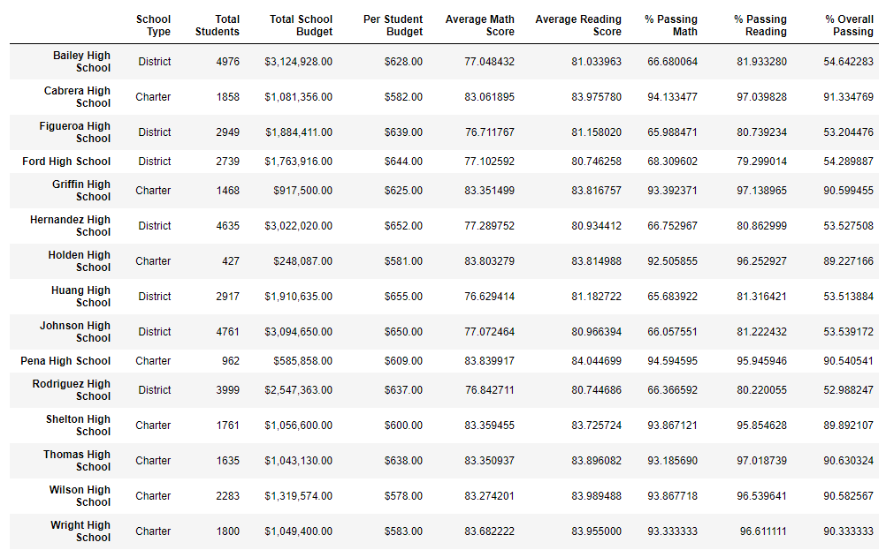
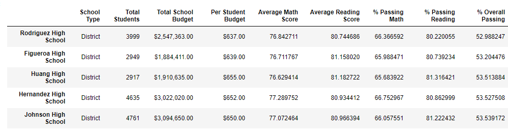

# School_District_Analysis
Module 4 assignment
## Overview of the school district analysis
In this analysis, we help Maria review student scores for the school board. After evidence of academic dishonesty were suspected, we removed all scores for Thomas High School (THS) 9th grade students and re-analyzed the data.
## Results
First, we used the `loc` method to locate and replace all grade 9 math and reading scores from THS students using the imported module numpy and the `np.nan` function.  
```
student_data_df.loc[(student_data_df['school_name'] == 'Thomas High School')
                    & (student_data_df['grade'] == '9th'),'reading_score'] = np.nan
```
### Student data


The dataframe was reassembled with the new data and we confirmed `NaN` appeared in the select cells in the district summary.

### District summary


In order to recalculate averages, we removed the 9th grade THS students from our total count and continued with further analysis. 
The district summary was not greatly affected by the suppression of THS 9th grade scores with at most 0.3% change.

### School summary


For the school summary, THS scores for math and reading were again minimally affect but the % passing was much lower by ~25% if we did not replace the value with the new student count. After adjusting the total student count these % passing values were not changed much.
 
### Top schools


### Bottom schools


Overall, the ranking for Thomas High School was not modified after removing the scores for 9th grade and THS remained in second place.

### Math score


### Reading scores


In the score by grades table the major difference is that there is no average calculated for THS 9th grade students and therefore `NaN` is displayed.

### Scores by school spending


Looking at the scores by school spending, these is also no significant differences after the new analysis. 

### Scores by school size


The same no difference result was observed in the score by school size table. 

### Scores by school type


In the school type summary, no difference can be observed.

## Summary
To summarize, removing THS 9th grade scores without adjusting our student count had significant effect by dropping the averages from the 90s to the 60s. Of course, this is like giving a score of 0% to all THS 9th grade students. Therefore, we adjusted the student count to exclude THS 9th graders and then the overall averages and rankings were similar to when they were included only by a few decimals. It is important to adjust our student count to exclude those with no scores otherwise we punish everyone by assigning zero. If there was confirmed academic dishonesty, it di not affect the school average because 9th graders were right on or close to THS average. Of course, if cheating is confirmed a zero could be assign and this would drop the averages much more.
